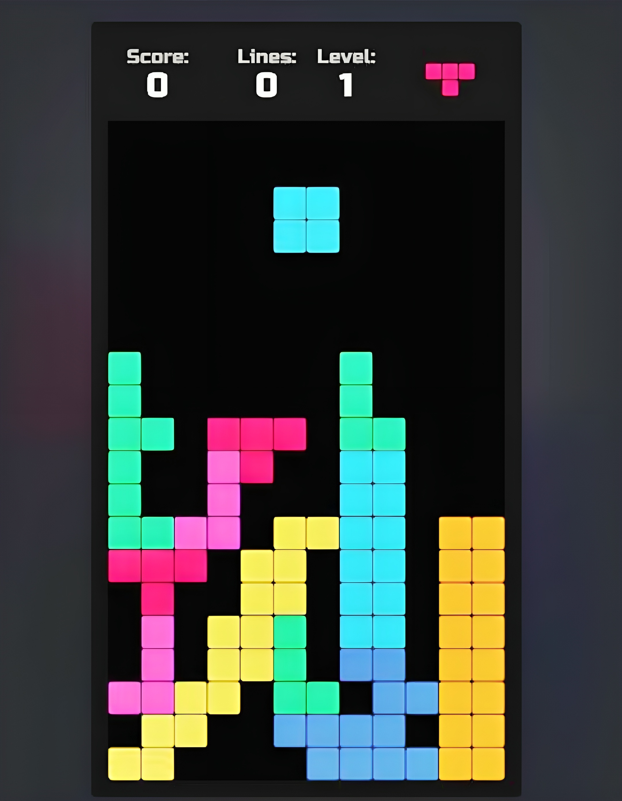

Tetris Game Deployment with ArgoCD and Minikube
======================================================

<div align="center">
  
</div>

Features
--------

*   **Containerization**: The Tetris application is packaged in a Docker image.
    
*   **Kubernetes Deployment**: The application is deployed on a Minikube cluster.
    
*   **ArgoCD for GitOps**: ArgoCD is utilized to manage the Kubernetes resources declaratively.
    
*   **Load Balancing**: The application is exposed using a Kubernetes service with a LoadBalancer.
    

Tools and Technologies
----------------------

*   **Minikube**: A local Kubernetes cluster to simulate production environments.
    
*   **kubectl**: Command-line tool to interact with the Kubernetes cluster.
    
*   **ArgoCD**: Continuous delivery tool for Kubernetes applications.
    
*   **Docker**: For creating and managing the Tetris application image.

Prerequisites
-------------

*   Docker installed on your machine.
    
*   Minikube installed and running.
    
*   kubectl configured to access your Minikube cluster.
    
*   ArgoCD installed and running in the cluster.
    

Installation and Setup
----------------------

1.  **Install Minikube**: Follow the [Minikube installation guide](https://minikube.sigs.k8s.io/docs/start/?arch=%2Fwindows%2Fx86-64%2Fstable%2F.exe+download).
    
2.  **Install kubectl**: Refer to the [kubectl installation instructions](https://kubernetes.io/docs/tasks/tools/install-kubectl-linux/).
    
3.  **Install ArgoCD**:
    
    *   Follow the [ArgoCD installation guide](https://www.fosstechnix.com/install-argocd-on-minikube-with-ubuntu-24-04/).
        
    *   Ensure ArgoCD is deployed and running in your Kubernetes cluster.
      
          ```    
          kubectl get all -n argocd
          ```
        
4.  **Clone the GitHub repo**:

       ```
        git clone https://github.com/shamim-iq/Tetris-Game-deploy-with-ArgoCD.git
       ```
    
5.  **Access ArgoCD on your browser**:

       ```
        kubectl port-forward svc/argocd-server -n argocd --address 0.0.0.0 8080:443 &
       ```

*   Access ArgoCD on `https://<server-ip>:8080/` using your browser.

*   Add the repository and create an application on the ArgoCD platform.

Accessing the Application
-------------------------

*   Once deployed, the Tetris application will be available at the external IP of the LoadBalancer.

       ```    
        minikube tunnel &
       ```

       ```    
        kubectl get svc tetris-service
       ```

       ```    
        kubectl port-forward svc/tetris-service --address 0.0.0.0 8081:80
       ```

*   Access the application on `https://<server-ip>:8081/` using your browser.

**Note**: Make sure to open the necessary ports in the security groups of the server.
    
    
